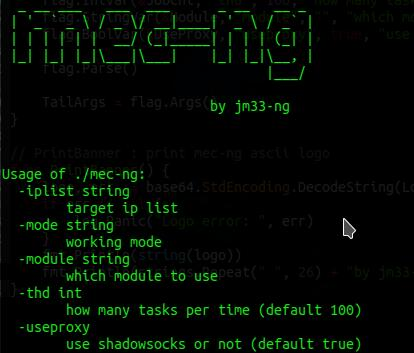

# mec-ng
pentest toolbox

> NOTE: this tool is still under early-stage development, if anything goes wrong, please open an issue

## features

- [x] zoomeye crawler with multi-thread
- [x] fast internet sweeping using masscan
- [x] execute custom exp with process-level concurrency
- [ ] mass brute-force
- [ ] built-in exploit packs

## screenshot

## disclaimer

- please use this tool only on authorized systems, im not responsible for any damage caused by users who ignore my warning
- i do not own the code of adapted exploits or tools
- exploits are adapted from other sources, please refer to their author info
- due to my limited programming experience, you can expect some silly bugs
